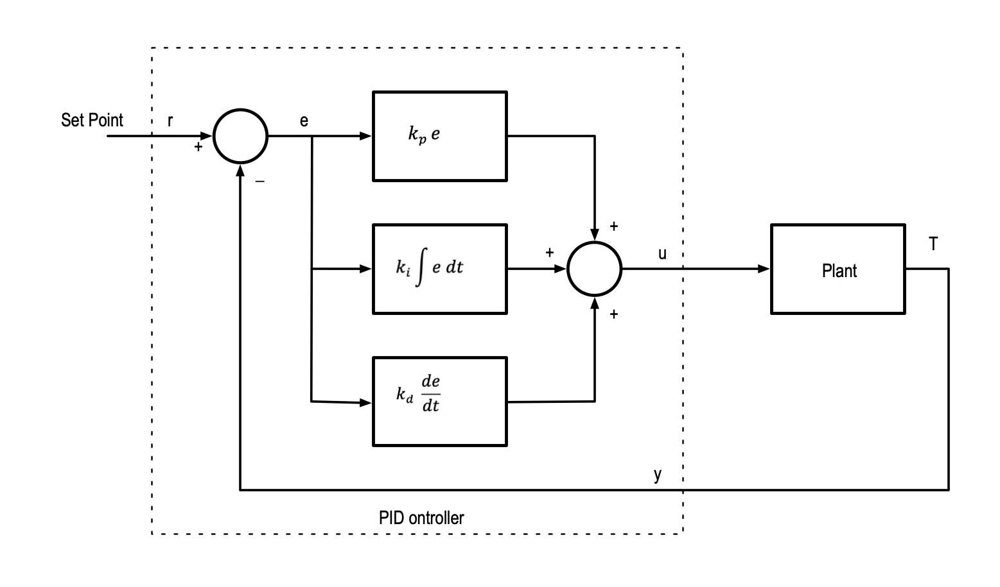
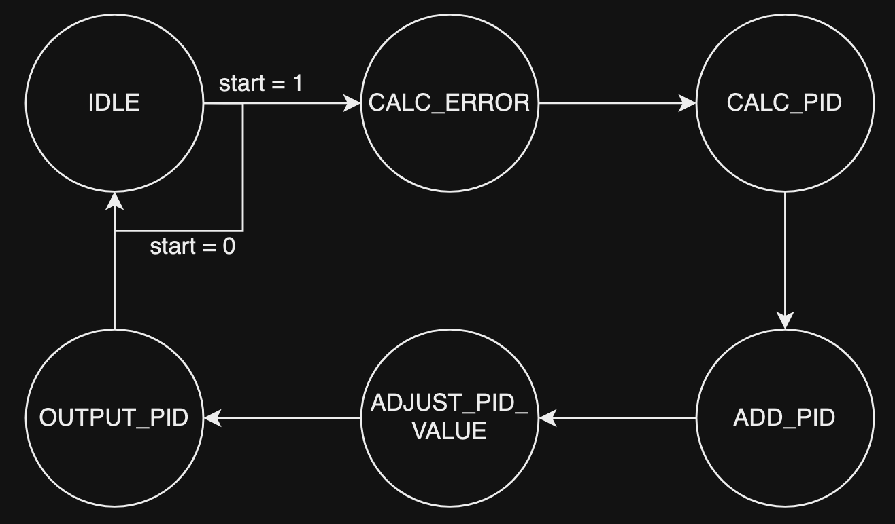

# Overview

PID controllers are widely used in automations. They are usually implemented in analog circuits or in software. This project aims to implement a PID controller in FPGA, which can improve the efficiency, power, footprint, and customizability. This PID controller can be used for various applications. This can be used in various applications such as temperature control in HVAC systems, voltage regulation, CNC machines, etc.

# PID Controller

A PID controller operates by acquiring the error, which is the difference between the input and the setpoint. The setpoint is the desired output. With the error, we can operate on the error using proportional, integral, and derivative equations.

A simple way to think of PID is to think of how it can be used to control something like a servo:
- Proportional tells the servo to go to the desired location if it is not there yet
- Derivative tells the servo to slow down if it is approaching the desired location
- Integral tells the servo to speed up if it hasn't reached the desired location in a long time

The PID controller will calculate the P, I, and D values individually and add them up to get the control variable. The control variable used for controlling the system and it will be fed back into the system as the new input so that the controller can calculate the new error and adjust the control variable according to the new P, I, D values.

The formula for calculating the total PID value (control variable):

$$
u(t) = K_p e(t) + K_i \int e(t) dt + K_d \frac{de}{dt}
$$

Where:
- $u(t)$: PID control variable
- $e(t)$: Error value
- $de$: Change in error value 
- $dt$: Change in time
- $K_p$: Proportional gain
- $K_i$: Integral gain
- $K_d$: Derivative gain

The gain constants need to be tuned in order to fit the application. If we tune the constants to be too high, the system will be overdamped. An overdamped system will take too long to correct its error. If we tune the constants to be too low, the system will be underdamped. An underdamped system will oscillate and overshoot the desired state a lot of the time.

We want to tune the system to be critically damped. This allows the system to approach the desired value quickly with a error rate close to 0.

# Implementation

The PID controller that we implemented requires a clock and reset signal. For the inputs, the controller takes in a 1-bit `pid_start` signal and a 16-bit `data_in` signal.

The controller ultilizes a finite state machine with 6 different states to handle each stage of calculation and operation:

| State | Description |
| --- | --- |
| **IDLE** | Wait for start signal |
| **CALC_ERROR** | Calculate difference between input and setpoint (error) |
| **CALC_PID** | Calculate P, I, D based on error |
| **ADD_PID** | Add up P, I, D value |
| **ADJUST_PID_VALUE** | Align the PID total value with 16-bit |
| **OUTPUT_PID** | Output PID total |

We can set the setpoint in the controller and tune the controller by modifying the PID constants kp, kd, and ki.

The controller's output will be the control variable, which can be sent back to the system to correct the error. The output is limited to a range of 1-65535.

# Schematic

# Simulation

Setpoint: 54321

- No error (`data_in` = 54321):

- Negative error (`data_in` = 56000):

- Positive error (`data_in` = 52000):

# Reprogrammability of controller

The PID controller we have currently can take 16-bit input data and can output a 16-bit data (which represents the control variable). However, because of the reprogrammability of FPGA, we can modify this to take in data with different bit widths, which makes this highly configurable.

# Advantages over traditional PID controller

Because of the reprogrammability of FPGA, it makes PID controllers implemented in FPGA much more flexible compared to traditional analog implementations. For example, an FPGA PID controller made for servo motors can be later reprogrammed to be used for a voltage regulator. This level of flexibility and reprogrammability can make PID controller in FPGA very cost effective. 

Because the PID controller in FPGA is implemented at register transfer level, it is much faster compared to software implementations. Since software implementations are often done with high-level programming languages like C/C++, they make the PID controller a lot slower. The FPGA PID controller can calculate and operate at a faster speed.
