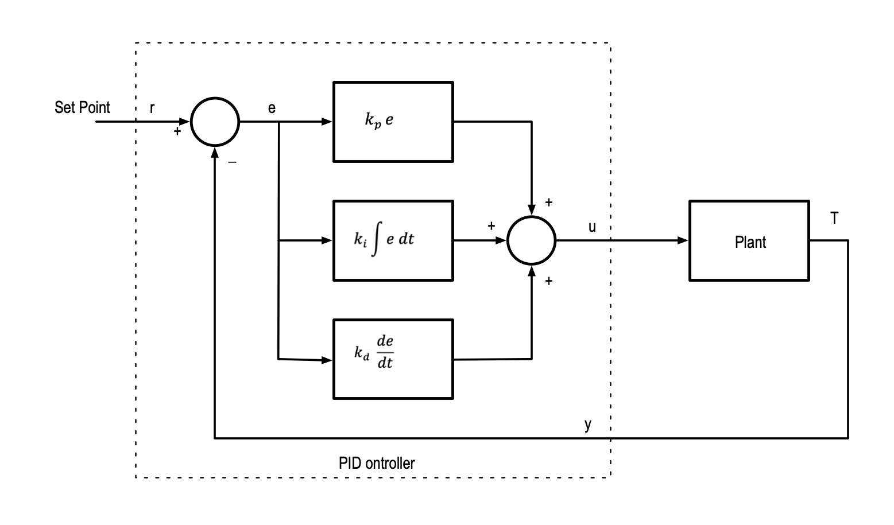
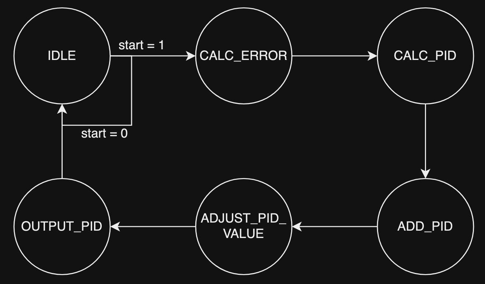

# PID Controller

A PID controller operates by acquiring the error, which is the difference between the input and the setpoint. The setpoint is the desired output. With the error, we can operate on the error using proportional, integral, and derivative equations.

A simple way to think of PID is to think of how it can be used to control something like a servo:
- Proportional tells the servo to go to the desired location if it is not there yet
- Derivative tells the servo to slow down if it is approaching the desired location
- Integral tells the servo to speed up if it hasn't reached the desired location in a long time

The PID controller will calculate the P, I, and D values individually and add them up to get the control variable. The control variable used for controlling the system and it will be fed back into the system as the new input so that the controller can calculate the new error and adjust the control variable according to the new P, I, D values.

The formula for calculating the total PID value (control variable):

$$
u(t) = K_p e(t) + K_i \int e(t) dt + K_d \frac{de}{dt}
$$

Where:
- $u(t)$: PID control variable
- $e(t)$: Error value
- $de$: Change in error value 
- $dt$: Change in time
- $K_p$: Proportional gain
- $K_i$: Integral gain
- $K_d$: Derivative gain

The gain constants need to be tuned in order to fit the application. If we tune the constants to be too high, the system will be overdamped. An overdamped system will take too long to correct its error. If we tune the constants to be too low, the system will be underdamped. An underdamped system will oscillate and overshoot the desired state a lot of the time.

We want to tune the system to be critically damped. This allows the system to approach the desired value quickly with a error rate close to 0.

# States

| State | Description |
| --- | --- |
| **IDLE** | Wait for start signal |
| **CALC_ERROR** | Calculate difference between input and setpoint (error) |
| **CALC_PID** | Calculate P, I, D based on error |
| **ADD_PID** | Add up P, I, D value |
| **ADJUST_PID_VALUE** | Align the PID total value with 16-bit |
| **OUTPUT_PID** | Output PID total |

# PID in FPGA

The PID controller we have currently can take 16-bit input and can output a 16-bit data (which represents the control variable). However, because of the reprogrammability of FPGA, we can modify this to take in data with different bit widths, which makes this highly configurable
